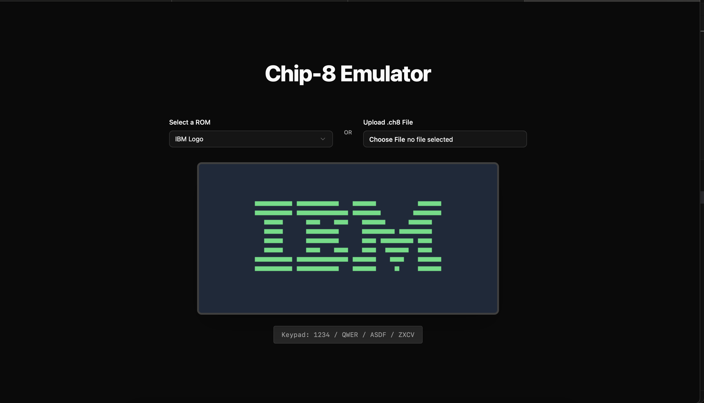
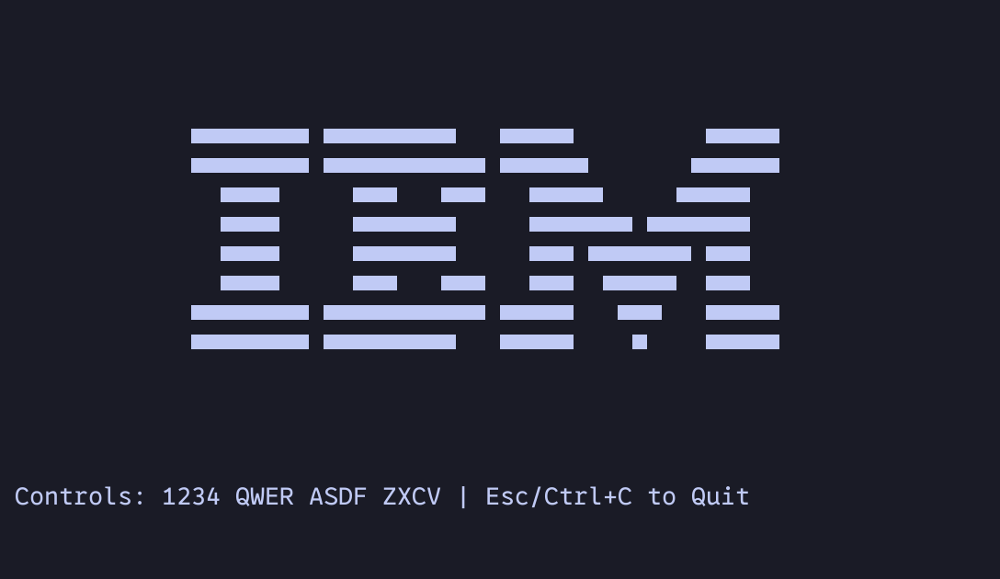

# Chip-8 Emulator

Chip-8 emulator written in Rust. Runs in the CLI or on the web through WebAssembly. 

Try it out on https://chip8.eilayk.com

## Web Player

## CLI Player

## Repo Structure

- `chip-8/`: The core Chip-8 emulator library written in Rust. This contains the main emulation logic, including CPU, memory, display, and input handling.
- `cli/`: A command-line interface for running the emulator in the terminal. Uses the `chip-8` library and provides keyboard input mapping.
- `web/`: The web-based player using WebAssembly. Contains:
  - `pkg/`: Compiled WebAssembly module and TypeScript bindings.
  - `ui/`: React-based frontend built with Vite.

